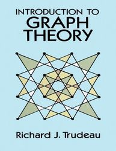

#  Anne Guinard : Test 20231103 - excerpt with excerpt 1 

<a href="../../assets/attachments/3592781825/3592781832.pdf"
class="confluence-embedded-file" data-nice-type="PDF Document"
data-file-src="../../assets/attachments/3592781825/Trudeau%20-%201993%20-%20Introduction%20to%20graph%20theory_pdf_11.2MB.pdf?version=1&amp;modificationDate=1699037370864&amp;cacheVersion=1&amp;api=v2"
data-linked-resource-id="3592781832"
data-linked-resource-type="attachment"
data-linked-resource-container-id="3592781825"
data-linked-resource-default-alias="Trudeau - 1993 - Introduction to graph theory_pdf_11.2MB.pdf"
data-mime-type="application/pdf" data-has-thumbnail="true"
data-linked-resource-version="1"
data-media-id="43b7e9ac-f836-4cfc-a97b-e547225d3f6a"
data-media-type="file"></a>

Definitions

**p.1**

**Dummy excerpt 1**

***Definition 3.*** A set *A* is said to be a subset of a set *B*,
denoted “*A⊂ B*”, if every element of *A* is also an element of *B*.

**p. 2**

**Dummy excerpt 2**

***Definition 6.*** The elements of the
vertex set of a graph are called vertices (singular: vertex) and
the elements of the edge set are called edges. We shall denote the
number of vertices by “v” and the number of edges by “e”.

## Attachments:

 [Trudeau - 1993 - Introduction to graph
theory_pdf_11.2MB.pdf](../assets/attachments/3592781825/3592781832.pdf)
(application/pdf)  

[image-20231030-122245.png](../assets/attachments/3592781825/3592781835.png)
(image/png)  

[image-20231103-182856.png](../assets/attachments/3592781825/3592781838.png)
(image/png)  

[image-20231103-183025.png](../assets/attachments/3592781825/3592781841.png)
(image/png)  

[image-20231103-183117.png](../assets/attachments/3592781825/3592781844.png)
(image/png)  

[image-20231103-183228.png](../assets/attachments/3592781825/3592781847.png)
(image/png)  
